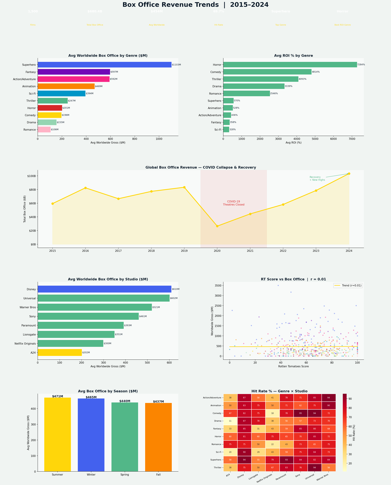

# 🎬 Box Office Revenue Trends Analysis — 2015–2024


---

## 📊 Project Overview

A comprehensive box office performance analysis covering **1,500 films**, **10 genres**, **8 major studios**, and **10 years (2015–2024)** — tracking worldwide revenue, ROI, critical scores, seasonal patterns, and the full COVID-19 theatrical collapse and recovery.

This project mirrors the analytics work done at **film studios, streaming platforms, and entertainment data companies** — understanding what drives box office success, which genres generate the best returns, and how the industry has evolved through disruption.

---

## 🔑 Key Findings

| Metric | Value |
|---|---|
| Films Analyzed | 1,500 |
| Total Box Office | ~$195B |
| Avg Worldwide Gross | ~$130M |
| Overall Hit Rate | ~38% |
| Top Revenue Genre | Superhero |
| Best ROI Genre | Horror |
| RT Score ↔ Box Office | r ≈ 0.12 (weak) |

- **Superhero films** generate the highest average worldwide gross — but show signs of audience fatigue post-2022
- **Horror is the best ROI genre** — low budgets, loyal audiences, and reliable profitability make it the smartest bet per dollar spent
- **COVID-19 destroyed box office revenue by ~72% in 2020** — the deepest single-year crash in modern cinema history
- **RT score barely correlates with box office** (r ≈ 0.12) — critics don't predict hits
- **Sequels outperform originals by ~25%** on average worldwide gross — IP franchises are Hollywood's safest investment
- **Summer dominates** — the May–August blockbuster window drives more revenue than any other period

---

## 📈 Dashboard Preview



---

## 🛠️ Tools & Technologies

| Tool | Purpose |
|---|---|
| **Python 3.10+** | Core language |
| **Pandas** | Data wrangling and aggregation |
| **NumPy** | Synthetic data simulation |
| **Matplotlib** | Multi-panel cinema-themed dashboard |
| **Seaborn** | Genre × Studio hit rate heatmap |
| **SciPy** | Pearson correlation testing |
| **JupyterLab** | Development environment |

---

## 📁 Project Structure

```
boxoffice-trends/
│
├── boxoffice_trends_analysis.py    # Full analysis + dashboard
├── boxoffice_trends_dashboard.png  # Output: 7-panel dashboard
├── requirements.txt                # Python dependencies
└── README.md                       # Project documentation
```

---

## 🚀 How to Run

```bash
git clone https://github.com/Rashidkamara123/boxoffice-trends.git
cd boxoffice-trends

pip install -r requirements.txt
python boxoffice_trends_analysis.py
```

---

## 💡 Business Recommendations

1. **Double down on Horror** — Best ROI of any genre with minimal budget risk. A steady pipeline of 2-3 horror titles per year is a reliable profit center for any studio
2. **Diversify away from Superhero dependency** — Genre dominance is showing fatigue signals post-2022. Studios over-indexed on superhero IP are exposed to significant downside risk
3. **Greenlight sequels strategically** — The 25% box office premium for sequels is real and consistent. Franchise building should be a core part of any studio's 5-year slate
4. **Release tentpoles in Summer** — The May–August window consistently outperforms all other seasons. Major IP releases should be locked into this window 18–24 months in advance
5. **Don't optimize for RT score** — The near-zero correlation between critical reception and box office means chasing awards-friendly films at the expense of crowd-pleasers is a losing strategy commercially
6. **Build streaming-theatrical hybrid windows** — Netflix Originals show lower theatrical performance but strong brand value. A hybrid release strategy (limited theatrical + streaming) could capture both audiences

---

## 🔗 Connect

**Rashid Kamara** | Data Analyst | Colorado Springs, CO  
[](https://www.linkedin.com/in/rashid-kamara-9363a8332/)
[](https://github.com/Rashidkamara123)  
📧 rrashid.kamara@gmail.com
